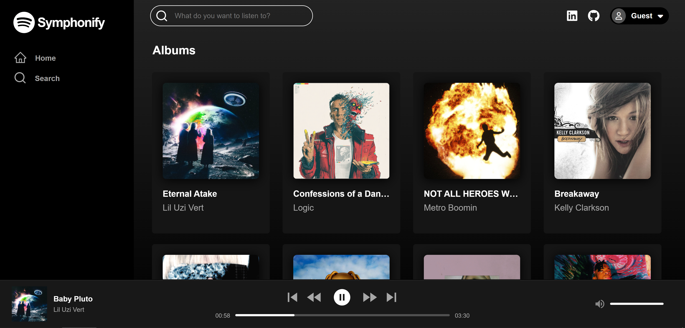

# Symphonify (Spotify-Clone)

Hi! Welcome to [Symphonify](https://symphonify.onrender.com/), my very own clone of Spotify. 

## Overview & Functionalities:

I created Symphonify's using React for the frontend and Ruby on Rails for the backend. Within the app, the user can view, play, and search for various albums and songs. Symphonify has an interactive playbar allowing the user to skip, rewind, play, pause and change the volume of tracks. The user is also able to create their very own custom playlists. Feel free to login via demo user to enjoy all of Symphonify's functionality and sleek styling. Thank you for checking out Symphonify!




## Technologies & Libraries Used:

- React
- Redux
- AWS
- Javascript
- Ruby on Rails
- PostgreSQL
- JSON / Jbuilder
- HTML
- CSS
- Render
- React-H5-Audio-Player
- React-Icons
- Font Awesome

## Sample Album Thunk Actions & Reducer Using React-Redux

```js
export const fetchAlbums = () => async dispatch => {
    const response = await fetch(`/api/albums`);
    const data = await response.json();
    return dispatch(receiveAlbums(data));
}

export const fetchAlbum = (albumId) => async dispatch => {
    const response = await fetch(`/api/albums/${albumId}`);
    const data = await response.json();
    
    return dispatch(receiveAlbum(data));
}

//reducer

const albumsReducer = (state = {}, action) => {
    const nextState ={ ...state }

    switch (action.type) {
        case RECEIVE_ALBUMS:
            return { ...nextState, ...action.albums };
        case RECEIVE_ALBUM:
            nextState[action.payload.album.id] = action.payload.album;
            return nextState;
        default:
            return state;
    }
}
```

### Main Search Bar Component Including React Hooks & HTML Input

```js
function SearchBar() {

    const dispatch = useDispatch();
    const albums = useSelector(state => state.albums ? Object.values(state.albums) : []);

    const [searchValue, setSearchValue] = useState("")
    const [searchedAlbums, setSearchedAlbums] = useState([])


    const handleChange = (e) => {

        setSearchValue(e.target.value)

        setSearchedAlbums([])

        if (e.target.value !== "") {
            let counter = 0;
            albums.forEach((album) => {
                if (album.title.toLowerCase().includes(e.target.value.toLowerCase()) ||
                        album.artist.name.toLowerCase().includes(e.target.value.toLowerCase())) {
                        setSearchedAlbums((searchedAlbums) => [...searchedAlbums, album])
                        counter++;
                }
            })
            if (counter === 0) {
                setSearchedAlbums("empty")
            }
        }
    }

    dispatch(receiveSearchedAlbums(searchedAlbums))

    return (
        <>
            <FiSearch className='magnifying-glass' />
            <input type="text"
                className='search'
                placeholder='What do you want to listen to?'
                name=""
                onChange={handleChange}
                value={searchValue}
            />
        </>
    )
};
```

### Future Implementations
- CRUD playlists
- Like Songs & Liked Songs Playlist
- Custom Splash Page